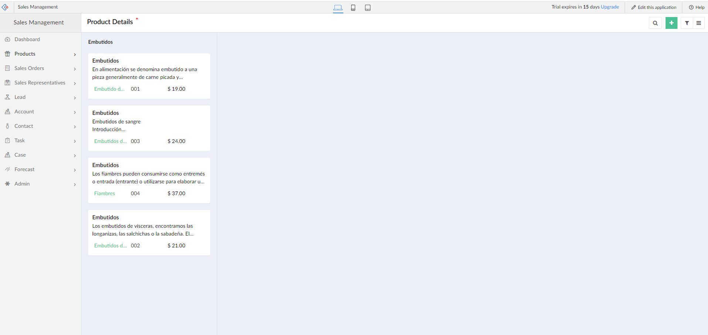
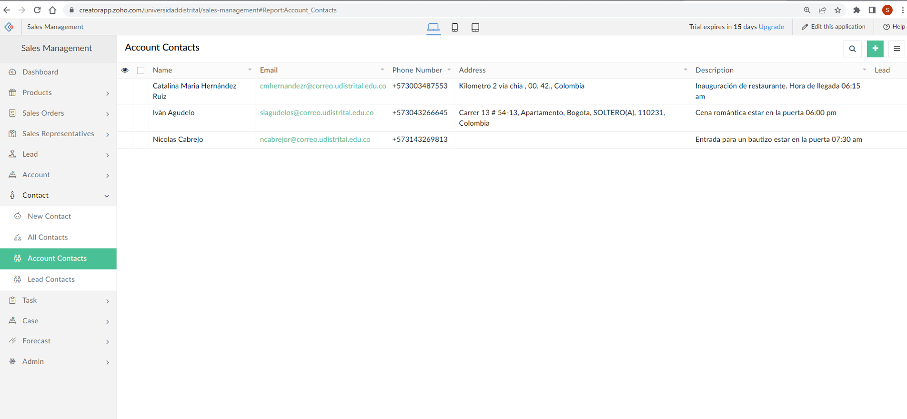

# No_Code
Autor: Sonia Luz Gonzàlez Pardo  20212395003

¿Quées ZOHO?

ZOHO es una empresa creada en la india, la cual se dedica  a crear soluciones que requieran desarrollo de software.

Sus herramientas estan basadas en:
- Web
- Tecnologìas de la informaciòn 

Se ingresa a la página principal url creator.zoho.com en la cual se puede observar que
tiene diferentes componentes como ventas, ordenes, manejo de empleados y demás.

Para llevar a cabo el ejercicio se utiliza el componente de ventas

Se selecciona lo que se desea instalar el cual muestra una pantalla donde se visualiza la instalación
del componente de ventas

Al ingresar al modulo, se escoge la sección por la cual le conviene iniciar a ingresar datos 

Vista general de como queda la sección completando datos 

Dashboard generales del contenido de los datos ingresados 

